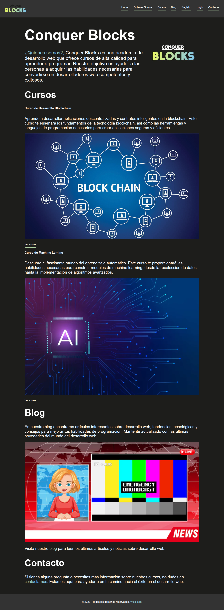

<h1 align="center" style="color: #0366d6;">
  ¡Bienvenido a este Proyecto HTML de la pagina Conquer Blocks Responsive!
</h1>

Este proyecto se centra en crear un sitio web responsive para una galería de arte moderno. La página se adapta a tres tamaños de pantalla: móvil (414px), tablet (768px) y desktop (1200px), garantizando una experiencia visual óptima en cada dispositivo.

## Características 🚀

- **Diseño Responsive:** Adaptable a móviles, tabletas y escritorios.
- **HTML y Sass:** Desarrollado con HTML y preprocesado con Sass para una mejor estructura y estilo.
- **Medios de Comunicación:** Las imágenes y contenido se ajustan perfectamente a cada pantalla.

## Vista Previa 🖼️

---

  

 

   
   
   

---

## Cómo Usar 🛠️

1. Clona este repositorio: `git clone [https://github.com/Savege-Khepri/proyecto_HTML_estilizado/blob/main/Home-de-Conquer-Blocks-Academy.png](https://github.com/Savege-Khepri/proyecto_HTML_estilizado.git)`
2. Abre el archivo `index.html` en tu navegador.

¡Y eso es todo! Ahora puedes explorar la galería de arte moderno en diferentes dispositivos.

## Trabajo Freelance 💼

Estoy disponible para trabajar en proyectos de diseño web, ya sea para particulares o empresas. Si necesitas ayuda con el diseño de tu sitio web o tienes algún proyecto en mente, ¡no dudes en contactarme en 
 

